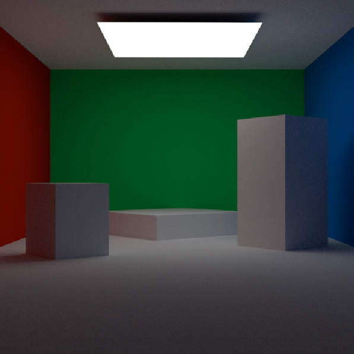

# Enclosed Cornell Box
A variation of the classic Cornell Box, with one extra object, colored walls and a forth wall behind the camera that ensures rays do not escape. 
Includes a white area light and only diffuse materials.

