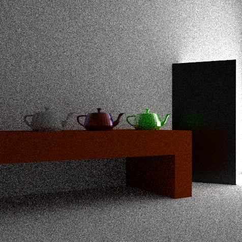

# Simple Veach
A simplified version of the "Veach door" scene, specifically made to give path tracing based rendering techniques a hard time. For example, the image below was produced 
with path tracing using 256 samples per pixel and a maximum recursion depth of 5.

